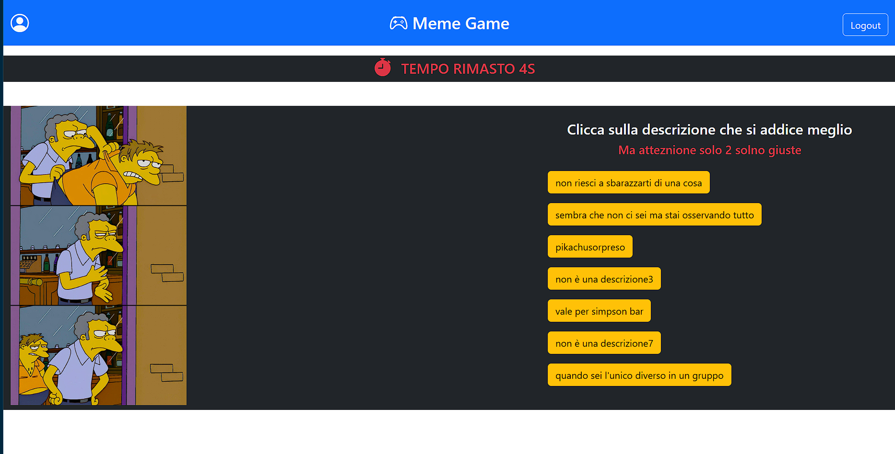
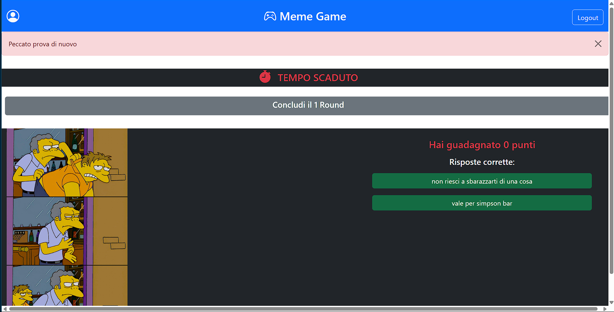

[](https://classroom.github.com/a/J0Dv0VMM)

# Exam #1: "Gioco dei Meme"

## Student: s326954 CATALANO VINCENZO

## React Client Application Routes

- Route `/`: è la landing page dell'applicazione nel quale tramite l'interfaccia si può scegliere se iniziare una
  partita, loggarsi, e se si è già loggati si può andare alla propria pagina personale
- Route `/game-round`: è la pagina in cui i giocatori giocano, cercando di indovinare la giusta descrizione tra le 7
  disonibili, a seconda se si è loggati o meno
  essa garantirà le funzioni per i rispettivi utenti, alla fine del terzo round il game verrà salvato automaticamente
  Per l'intera durata dei 3 round, nel caso di utenti loggati, il giocatore rimane su questa stessa pagina fino alla
  fine dell'ultimo round. Si puo arrivare a questa pagina solo tramite la landing page e al suo corrispettivo bottone
- Route `/riepilogo`: è la pagina in cui i giocatori loggati possono recarsi una volta finiti i round e in cui
  verrà mostrato il riepilogo con le sole risposte date correttamente, composto da immagine del meme, descrizione
  selezionata e punteggio ottenuto
- Route `/personal`: è la pagina in cui i giocatori loggati possono consultare le proprie statistiche dei game
  precedenti, composto da immagine del meme, descrizione selezionata e punteggio ottenuto.
  Si puo arrivare a questa pagina in qualsiasi momento, solo se si è loggati, premendo corrispettivo bottone a forma di
  user sempre presente nella navbar
- Route `/login`: è la pagina in cui i giocatori possono loggarsi al proprio account, si presenta come un form su cui
  inserire username e password. Si puo arrivare a questa pagina in qualsiasi momento, solo se non si è loggati, premendo
  corrispettivo bottone presente nella navbar

## API Server

### Recupera il meme dall'id

- GET `/api/memes/:id`
    - Description: Recupera il meme a seconda dell'id
    - param: id ->intero legato al id unico per ogni meme
    - Response: `200 OK` (success)
    - Response body: Un oggetto che rappresenta un meme :
  ``` json
    {id: 1, title: cespuglio,name: image: cespuglio.jpg}
    ```
    - Error responses:  `404` se non viene trovato nessun meme, `422` se l'id inserito è invalido o `500` per tutti gli
      altri casi

### Recupera il meme

- GET `/api/users/:userId/memes/random`
    - Description: Recupera il meme a seconda della politica di randomizzazione adottata dal server
    - param: userId ->intero legato al id unico per ogni utente
    - Response: `200 OK` (success)
    - Response body: Un oggetto che rappresenta un meme :
  ``` json
    {id: 1, title: cespuglio,name: image: cespuglio.jpg}
    ```
    - Error responses:  `404` se non viene trovato nessun meme, `422` se l'id inserito è invalido o `500` per tutti gli
      altri casi

### Recupera le descrizioni

- GET `/api/memes/:id/descriptions`
    - Description: Recupera le 7 descrizioni, secondo la politica del server, del meme associato all'id
    - param: id ->intero legato al id unico per ogni meme
    - Response: `200 OK` (success)
    - Response body: Un oggetto che rappresenta un meme :
  ``` json
    {id: 26, text:gatto}
    ```
    - Error responses:  `404` se non viene trovato nessuna descrizione, `422` se l'id inserito è invalido o `500` per
      tutti gli altri casi

### Controlla la risposta data

- POST `/api/responses/check`
    - Description: verifica che la descrizione selezionato è corretta
    - param: _None_
    - reqest body: una descrizione da controllare:
       ``` json
       {id:1,text:"cespuglio""}
       ```
    - Response: `200 OK` (success)
    - Response body: Un booleano come conferma :
  ``` json
    {true}
    ```
    - Error responses:  `422` se i dati inseriti non sono validi o `500` per tutti gli
      altri casi

### Controlla tutte le descrizioni

- POST `/api/memes/:id/descriptions/right`
    - Description: verifica che quale delle descrizioni inviate sono corrette
    - param: id->intero legato al id unico per ogni meme
    - reqest body: Un array di descrizioni:
        ``` json
         [{id:1,text:"cespuglio""},
          {...}]
       ```
    - Response: `200 OK` (success)
    - Response body: Un array di booleani come conferma :
   ``` json
    {false,false,true,flase,...}
   ```
    - Error responses:  `422` se l'id inserito è invalido e se i dati inseriti non sono validi o `500` per tutti gli
      altri casi

### Salva temporaneamente i meme visti

- POST `/api/users/memes/set-seen`
    - Description: Api disponibile sono se l'utente è loggato. Salva i meme che sono stati visti all'inteno di uno
      stesso round
    - param: _None_
    - rquest body: { userId,memeId }
    - Response: `201 OK` (success)
    - Response body: il dato che è stato salvato nel db :
  ``` json
    {userId:1,memeId:1}
    ```
    - Error responses:  `422` se l'id inserito è invalido se i dati inseriti non sono validi o `500` per tutti gli altri
      casi

### Elimina i meme visti salvati temporaneamente

- DELETE `/api/users/:userId/memes/delete-seen`
    - Description: Api disponibile sono se l'utente è loggato. Elimina i meme che sono stati visti all'inteno di uno
      stesso round
    - param: userId -> intero legato al id unico per ogni utente
    - Response: `200 OK` (success)
    - Response body: una stringa di conferma :
  ``` json
    { "Meme eliminati"}
    ```
    - Error responses:`422` se l'id inserito è invalido o `500` per tutti gli altri casi

### Salva le risposte date

- POST `/api/responses/add`
    - Description: Api disponibile sono se l'utente è loggato. Salva nel sb tutte le 3 risposte date in ogni round di
      una partita
    - param: _None_
    - request body: { image,id,userId,memeId,response,point}
    - Response: `201` (success)
    - Response body: una stringa di conferma :
     ``` json
       { "Meme salvati"}
    ```
    - Error responses:`422` se l'id inserito è invalido o `500` per tutti gli altri casi

### Recupera tutte le paritte giocate

- GET `/api/users/:userId/insights`
    - Description: Api disponibile sono se l'utente è loggato. Recupera tutte le precedenti partite del giocatore
    - param: userId ->intero legato al id unico per ogni utente
    - Response: `200` (success)
    - Response body: array di Insight dove sono salvati tutti i precedenti round del giocatore :
       ``` json
         [{ id:..,memeId:..., points: 0 || 5, response:...}, {},...]
      ```
    - Error responses:  `422` se l'id inserito è invalido o `500` per tutti gli altri casi

### Crea la sessione

- POST `/api/sessions`
  - Description: Verifica e prende dal database l'utente con quello username e password
  - parma: _None_
  - request body: {username, password}
  - Response: `201` (success)
  - Response body: Un oggetto che rappresenta uno user :
  ``` json
    {id: 1, username: pippo@mail.it,name: pippo}
    ```
  - Error responses:  `401`

### Verifica la sessione

- GET `/api/sessions/current`
  - Description: Verifica che l'utente sia ancora loggato nella sessione
  - parma: _None_
  - Response: `200 OK` (success)
  - Response body: Un oggetto che rappresenta uno user :
  ``` json
    {id: 1, username: pippo@mail.it,name: pippo}
    ```
  - Error responses:  `401`

### Elimina la sessione

- DELETE `/api/sessions/current`
  - Description: Elimina la sessione dell'utente
  - param: _None_
  - Response: `200 OK` (success)
  - Response body: _None_


## Database Tables

- Table `users`: svolge la funzione di contenere tutti gli utenti registrati con un account,
  nessun campo può essere vuoto in quanto l'intera riga perderebbe senso. E' compost da:
    - id auto integer pk nt
    - email text nt
    - name text nt
    - password text nt
    - salt text nt
- Table `memems`: tabella che contiene tutti i meme che il gioco può mostrare,
  nessun campo può essere vuoto in quanto l'intera riga perderebbe senso. E' compost da:
    - id auto integer pk nt
    - title text nt
    - image text nt
- Table `descriptions`: tabella che contiene tutti le descrizioni per i meme che il gioco può mostrare,
  vi è una relazione 0..molti da entrambe le parti, in questo modo coesistono, una descrizione per più meme,
  una desccrizione per nessun meme. nessun campo può essere vuoto in quanto l'intera riga perderebbe senso. E' compost
  da:
    - id auto integer pk nt
    - text text nt
    - memeId integer fk ->`memems`.id nt
- Table `insight`: tabella che contiene tutta la cronologia delle precedenti partite del giocatore loggato
  solo l'ultimo campo può essere vuoto. E' compost da:
    - id auto integer pk nt
    - userId integer fk ->`users`.id nt
    - memeId integer fk ->`memems`.id nt
    - points integer nt
    - response text
- Table `tempSeenMemes`: tabella che contiene tutti i meme che il giocatore loggato ha visto durante un gioco da tre
  round,
  essa viene resettata ogni qualvolta un giocatore loggato inizia una partita nessun campo può essere vuoto in quanto
  l'intera riga perderebbe senso.
  E' compost da:
    - id auto integer pk nt
    - userId integer fk ->`users`.id nt
    - memeId integer fk ->`memems`.id nt

## Main React Components

- `App` (in `App.jsx`): componente principale dell'applicazione da dove vengono gestiti le informazioni generali come il
  log in e out e le routes
- `GameRound` (in `Game.jsx`): componente dedicato al gioco e all'interazione con l'utente. Esso aiutato dai suoi sotto
  componenti gestisce tutte le fasi del gioco,
  dalle fetch per ottenere informazioni dal server ai cambiamenti di stato per informare il giocatore della bontà delle
  sue risposte. Si presenta come una immagine a sinistra e una lista di descrizioni a destra cliccabili per la selezione
  della risposta. Dopo aver cliccato l'applicazione reagirà mostrando la risposta data in verde se è corretta mentre in
  rosso se è sbagliata e in questo ultimo caso mostrerà le due risposte corrette in verde. Lo stesso caso della risposta
  sbagliata verrà mostrato quando non si è scelto nessuna risposta entro la fine del tempo. Dopodiché apparirà un
  pulsante con il quale si può passare al round successivo per quanto riguarda gli utenti loggati, mentre ad un nuovo
  gioco per gli ospiti. Al termine dell'ultimo round il game verrà salvato automaticamente
- `Timer` (in `Timer.jsx`): componente dedito al funzionamento del timer di 30 secondi a meme ed essa gestirà lo
  scenario in caso di mancata risposta dell'utente entro il tempo limite
- `Header` (in `Header.jsx`): componente che è sempre presente nei render dell'applicazione in tutte le sue routes. Esso
  fornisce al giocatore la possibilità in qualunque momento di loggarsi o sloggarsi, di accedere alla pagina personale e
  di tornare al munu principale
- `Riepilogo` (in `Riepilogo.jsx`): componente che viene chiamato tramite la pressione di un bottone alla fine
  dell'ultimo round dal componete `GameRound` e permette al giocatore di visualizzare tutte le risposte date
  correttamente insieme al punteggio e alla risposta data per round e al punteggio totale. Qui il gioco termina del
  tutto e il giocatore può solo ricominciare una nuova partita
- `UserPage` (in `UserPage.jsx`):componente chiamata da `Header` che si mostra solo se l'utente è loggato e che permette
  di accedere ad una pagina dedicata a mostrare tutte le precedenti partite divise per game e per round, mostrando
  l'immagine del meme, la risposta data e il punteggio ottenuto si per round che per game effettuate dal giocatore
  loggato
- `LogInForm` (in `UserPage.jsx`): componente dedito al log in dell'utente registrato. E' composto da un form con due
  campi; email e password

## Screenshot




## Users Credentials

- user: pippo@mail.it, password: test
- user: topolino@mail.it, password: test1 